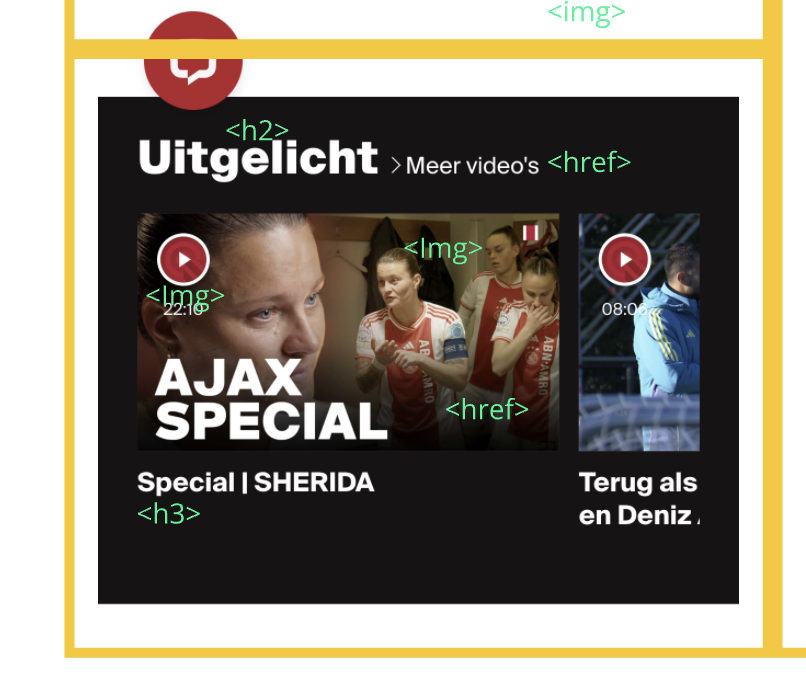

# Procesverslag
Markdown is een simpele manier om HTML te schrijven.  
Markdown cheat cheet: [Hulp bij het schrijven van Markdown](https://github.com/adam-p/markdown-here/wiki/Markdown-Cheatsheet).

Nb. De standaardstructuur en de spartaanse opmaak van de README.md zijn helemaal prima. Het gaat om de inhoud van je procesverslag. Besteedt de tijd voor pracht en praal aan je website.

Nb. Door *open* toe te voegen aan een *details* element kun je deze standaard open zetten. Fijn om dat steeds voor de relevante stuk(ken) te doen.

## Jij

  
uitwerken voor kick-off werkgroep

  ### Auteur:
  Tycho Diepgrond

  #### Je startniveau:
  rood

  #### Je focus:
  responsive

## Je website

  
uitwerken voor kick-off werkgroep

  ### Je opdracht:
  (https://www.ajax.nl/)

  #### Screenshot(s) van de eerste pagina (small screen): 
  hier de naam van de pagina  
  

  #### Screenshot(s) van de tweede pagina (small screen):
  hier de naam van de pagina  
  
 

## Toegankelijkheidstest 1/2 (week 1)

  
uitwerken na test in 2e werkgroep

  ### Bevindingen
 Voor mijn test heb ik samengewerkt met Joost. Tijdens het proces merkten we dat sommige aspecten van de test behoorlijk ingewikkeld waren, wat ervoor zorgde dat niet alles meteen duidelijk was.

Een belangrijk aandachtspunt was dat de HTML-code veel fouten liet zien in de validator. Dit is iets wat ik zeker wil verbeteren in mijn website. Daarnaast viel het ons op dat er geen alternatieve tekst werd gebruikt bij grafieken en andere complexe afbeeldingen, wat de toegankelijkheid aanzienlijk kan belemmeren.

Verder was er geen transcriptie beschikbaar voor de audio-inhoud, wat problematisch is voor gebruikers die slechthorend zijn of in situaties waarin geluid niet gebruikt kan worden. Ook ontbrak een skiplink, een essentiële functie voor gebruikers die navigeren met een toetsenbord of schermlezer.

Andere gemiste functionaliteiten waren een light- en dark-modus, een high-contrastmodus voor visueel beperkte gebruikers, en de mogelijkheid om achtergrondvideo’s te pauzeren. Deze verbeterpunten zullen bijdragen aan een betere toegankelijkheid en gebruikservaring van de website.

## Breakdownschets (week 1)

  
uitwerken na afloop 3e werkgroep

  ### de hele pagina: 
  

  ### dynamisch deel (bijv menu): 
  

  ### wellicht nog een dynamisch deel (bijv filter): 
  

## Voortgang 1 (week 2)

  
uitwerken voor 1e voortgang

  ### Stand van zaken
  hier dit ging goed & dit was lastig (neem ook screenshots op van delen van je website en code)

  ### Agenda voor meeting
  samen met je groepje opstellen

  | Tycho: 
  als eerst willen we het gaan hebben over hoe we text over plaatjes kunnen plaatsen| tess: nu willen we het gaan hebben over grids en hoe je het best verschillende elementen aanspreekt.| Bente: wat meer te weten komen over de agenda en de planning de komende weken. 

  ### Verslag van meeting
  hier na afloop snel de uitkomsten van de meeting vastleggen

  - https://docs.emmet.io/cheat-sheet/ voor sneller code schhrijven
  - 
  - nog een punt
  - ...

## Voortgang 2 (week 3)

  
uitwerken voor 2e voortgang

  ### Stand van zaken
  hier dit ging goed & dit was lastig (neem ook screenshots op van delen van je website en code)

  ### Agenda voor meeting
  samen met je groepje opstellen

  | student 1      | student 2          | student 3    | student 4        |
  | ---            | ---                | ---          | ---              |
  | dit bespreken  | en dit             | en ik dit    | en dan ik dat    |
  | en dat ook nog | dit als er tijd is | nog een punt | dit wil ik zeker |
  | ...            | ...                | ...          | ...              |

  ### Verslag van meeting
  hier na afloop snel de uitkomsten van de meeting vastleggen

  - punt 1
  - punt 2
  - nog een punt
- ...

## Toegankelijkheidstest 2/2 (week 4)

  
uitwerken na test in 9e werkgroep

  ### Bevindingen
  Lijst met je bevindingen die in de test naar voren kwamen (geef ook aan wat er verbeterd is):

## Voortgang 3 (week 4)

  
uitwerken voor 3e voortgang

  ### Stand van zaken
  hier dit ging goed & dit was lastig (neem ook screenshots op van delen van je website en code)

  ### Agenda voor meeting
  samen met je groepje opstellen

  | student 1      | student 2          | student 3    | student 4        |
  | ---            | ---                | ---          | ---              |
  | dit bespreken  | en dit             | en ik dit    | en dan ik dat    |
  | en dat ook nog | dit als er tijd is | nog een punt | dit wil ik zeker |
  | ...            | ...                | ...          | ...              |

  ### Verslag van meeting
  hier na afloop snel de uitkomsten van de meeting vastleggen

  - punt 1
  - punt 2
  - nog een punt
  - ...

## Eindgesprek (week 5)

  
uitwerken voor eindgesprek

  ### Je uitkomst - karakteristiek screenshots:
  

  ### Dit ging goed/Heb ik geleerd: 
  Korte omschrijving met plaatjes

  

  ### Dit was lastig/Is niet gelukt:
  Korte omschrijving met plaatjes

  

## Bronnenlijst

  
continu bijhouden terwijl je werkt

  Nb. Wees specifiek ('css-tricks' als bron is bijv. niet specifiek genoeg). 
  Nb. ChatGpT en andere AI horen er ook bij.
  Nb. Vermeld de bronnen ook in je code.

  1. bron 1
  2. bron 2
  3. ...

