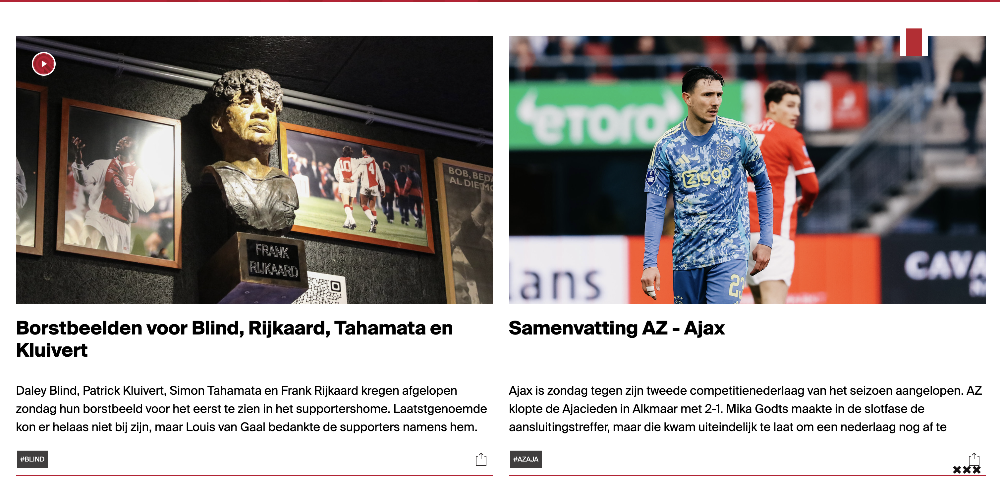
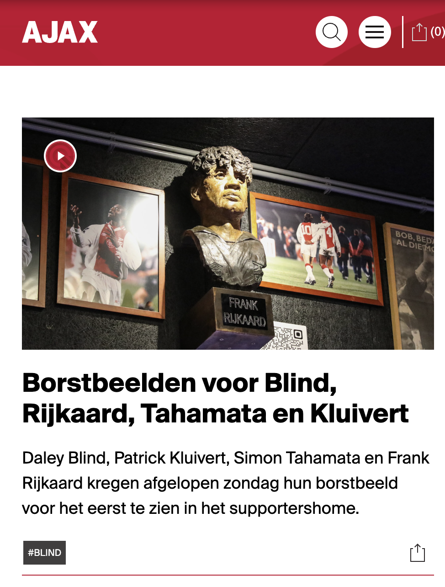

# Procesverslag
Markdown is een simpele manier om HTML te schrijven.  
Markdown cheat cheet: [Hulp bij het schrijven van Markdown](https://github.com/adam-p/markdown-here/wiki/Markdown-Cheatsheet).

Nb. De standaardstructuur en de spartaanse opmaak van de README.md zijn helemaal prima. Het gaat om de inhoud van je procesverslag. Besteedt de tijd voor pracht en praal aan je website.

Nb. Door *open* toe te voegen aan een *details* element kun je deze standaard open zetten. Fijn om dat steeds voor de relevante stuk(ken) te doen.

## Jij

  
uitwerken voor kick-off werkgroep

  ### Auteur:
  Tycho Diepgrond

  #### Je startniveau:
  rood

  #### Je focus:
  responsive

## Je website

  
uitwerken voor kick-off werkgroep

  ### Je opdracht:
  (https://www.ajax.nl/)

  #### Screenshot(s) van de eerste pagina (small screen): 
  hier de naam van de pagina  
  

  #### Screenshot(s) van de tweede pagina (small screen):
  hier de naam van de pagina  
  
 

## Toegankelijkheidstest 1/2 (week 1)

  
uitwerken na test in 2e werkgroep

  ### Bevindingen
 Voor mijn test heb ik samengewerkt met Joost. Tijdens het proces merkten we dat sommige aspecten van de test behoorlijk ingewikkeld waren, wat ervoor zorgde dat niet alles meteen duidelijk was.

Een belangrijk aandachtspunt was dat de HTML-code veel fouten liet zien in de validator. Dit is iets wat ik zeker wil verbeteren in mijn website. Daarnaast viel het ons op dat er geen alternatieve tekst werd gebruikt bij grafieken en andere complexe afbeeldingen, wat de toegankelijkheid aanzienlijk kan belemmeren.

Verder was er geen transcriptie beschikbaar voor de audio-inhoud, wat problematisch is voor gebruikers die slechthorend zijn of in situaties waarin geluid niet gebruikt kan worden. Ook ontbrak een skiplink, een essentiële functie voor gebruikers die navigeren met een toetsenbord of schermlezer.

Andere gemiste functionaliteiten waren een light- en dark-modus, een high-contrastmodus voor visueel beperkte gebruikers, en de mogelijkheid om achtergrondvideo’s te pauzeren. Deze verbeterpunten zullen bijdragen aan een betere toegankelijkheid en gebruikservaring van de website.

## Breakdownschets (week 1)

  
uitwerken na afloop 3e werkgroep

  ### de hele pagina: 
  

  ### dynamisch deel (bijv menu): 
  

  ### wellicht nog een dynamisch deel (bijv filter): 
  

## Voortgang 1 (week 2)

  
uitwerken voor 1e voortgang

  ### Stand van zaken
  Ik ben begonnen met alle content in het html bestand te plaatsen hier had ik weinig problemen mee omdat ik dit al best goed onder de knie had. waar ik nog wel wat problemen ervaarde was hoeveel sections ik voor 1 deel moet gebruiken dit heeft mij best wel wat tijd gekost om alles goed en logisch onder elkaar te krijgen. het lastige hier van was dat ik eerst alleen 2 artikelen boven aan had staan die ik wel samen responsief wil maken later dus moest ik goed uitzoeken zonder divs en classes te gebuiken. dit is uiteindelijk goed gelukt.

  ### foto 1: dit vond ik lastig maar is uit eindelijk goed gekomen:
  

  ### Agenda voor meeting
  samen met je groepje opstellen

  | Tycho: 
  als eerst willen we het gaan hebben over hoe we text over plaatjes kunnen plaatsen| tess: nu willen we het gaan hebben over grids en hoe je het best verschillende elementen aanspreekt.| Bente: wat meer te weten komen over de agenda en de planning de komende weken. 

  ### Verslag van meeting
  hier na afloop snel de uitkomsten van de meeting vastleggen

  - https://docs.emmet.io/cheat-sheet/ voor sneller code schhrijven
  - ik weet nu hoe ik doormiddel van grid tekst over plaatjes heen kan plaatsen, dit heeft mij erg goed geholpen om de eerste sectie te stijlen en dit heeft mij ook geholpen om grid echt goed te begrijpen. 
  - ik heb tijdens dit gesprek ook geleerd hoe ik verschillende elementen moest aanspreken dus hoe je in je css een bepaald element aanspreekt. denk hierbij aan: nth of type en hoe je meerdere achter elkaar kan plaatsen
  - hier gregen we ook een beter inzicht in hoe het komende weken er aan toe zou gaan.
  - ⁠Alle fonts in een mapje ‘font’ zetten in je basiswebsite map. Hoofdletters mag als je het goed doet. En gekke puntjes enzo weghalen.
  - ⁠Via inspecteren en kenmerken kun je afbeeldingen en fonts downloaden en bekijken
  - ⁠../fonts in css
  - ⁠Wanneer je normaal en Italic hebt bijvoorbeeld. 2x foutface opnemen in css bestand en dan font-style veranderen naar Italic.
  - ⁠Sterretje margin, padding en fontfamily

  - ⁠Mobiele weergave uitzetten bij inspecteren

  - ⁠Font-size: ..vw; Voor het verschuiven tekst of afbeeldingen
  - ⁠Font-size:clamp(1.5e  7vw, 5em); zodat de tekst niet kleiner wordt dan 1.5em en niet groter dan 5em.

  - ⁠List maken van articles bijvoorbeeld voor een carrousel. (Flexbox gebruiken)

  - ⁠li*3 betekent 3x een li = dat is emmet
  - nav>ul>li*5>a = dat is emmet 

## Voortgang 2 (week 3)

  
uitwerken voor 2e voortgang

  ### Stand van zaken
  ik ben hier niet heel veel verder gekomen dan vorige keer en dat komt omdat ik veel bezig was met het opmaken van de eerste artielen en de header voor small screen dit bleek toch best wat tijd te kosten. wat eigen niet zo heel goed ging en waar veel tijd naar toe ging was het maken van een carousel en hoe ik hier ook weer moest kijken hoeveel artikels binnen een sectie moesten zodat ik alles helder kon aanspreken in mijn css. 

  ### foto 1: dit vond ik lastig maar is uit eindelijk goed gekomen:

  ### Agenda voor meeting
  samen met je groepje opstellen
  Tycho: hoe krijg ik margin aan de zijkanten van het grid om alles goed uit te lijnen. bente: hamburger icoon is weg en die wil ik weer terug hebben. rest van het groepje was ziek dus die hadden geen vragen.  

  ### Verslag van meeting
  hier na afloop snel de uitkomsten van de meeting vastleggen

  - @fontface werd nog even goed behandeld omdat dat nog niet helemaal duidelijk was hoe je die moest gebruiken 
  - mijn grid werkte niet ik de artikelen niet direct uit de main aansprook waardoor het niet werkte ik had eerst dit: articel:nth-oftype(1) maar het moest zijn: main > articel:nth-of-type(1). verder is het mij nu ook gelukt om margin tussen de grids te grijgen doormiddel van collum gap en row gap. 
  - er werd even goed door alles heen gekeken om te kijken of alle code een beetje netjes was.

## Toegankelijkheidstest 2/2 (week 4)

  
uitwerken na test in 9e werkgroep

  ### Bevindingen
  Lijst met je bevindingen die in de test naar voren kwamen (geef ook aan wat er verbeterd is):
  
  
  Een groot pluspunt van mijn website is dat mijn HTML volledig correct is en zonder enige validatiefouten. Dit blijkt uit de validatietest die ik heb uitgevoerd. Dit is iets wat mijn website onderscheidt van die van Ajax, waar meerdere fouten in de HTML-structuur aanwezig zijn.
   

 Elke sectie in mijn website is voorzien van een duidelijke en unieke titel, wat zorgt voor structuur en overzicht. Dit is niet altijd het geval bij de Ajax-website, waar sommige secties ontbreken of geen aparte titels hebben. Door het toevoegen van een duidelijke structuur, verbetert de toegankelijkheid en wordt mijn website logischer opgebouwd voor gebruikers en screenreaders. 
   

  Elke pagina van mijn website bevat een H1-tag, zoals het hoort volgens webstandaarden. Dit zorgt ervoor dat de belangrijkste informatie direct herkend wordt. Dit is een verbetering ten opzichte van de Ajax-website, waar dit niet altijd consequent wordt toegepast.
   

  Het toevoegen van een tab-stijl is helaas niet gelukt binnen de gestelde tijd, maar ik heb er wel voor gezorgd dat elk interactief element op mijn website toegankelijk is met het toetsenbord. Dit maakt mijn website gebruiksvriendelijker voor mensen die navigeren zonder muis.
  
  - wel is elk element die aangesproken wilt worden tab baar. 
  

  -text altanatief voor coplexe foto's was niet nodig dus heb ik ook niet toegevoegd. 

Mijn website biedt zowel een dark mode als een light mode, wat een enorme verbetering is voor de toegankelijkheid. Gebruikers kunnen hiermee de modus kiezen die het meest comfortabel is voor hun ogen. De Ajax-website heeft deze functionaliteit niet, waardoor mijn website hierin duidelijk een stap vooruit is.

  dark mode:
  

  light mode:
  

  Daarnaast heb ik een high contrast-modus toegevoegd aan mijn website. Dit verbetert de leesbaarheid voor gebruikers met een visuele beperking. Ook deze functie ontbreekt op de Ajax-website, wat wederom een voordeel voor mijn ontwerp is.

 In de oorspronkelijke versie van mijn website had ik knoppen opgenomen binnen een <ul> element. Dit is echter geen goede manier en kan verwarrend zijn voor gebruikers en screenreaders. Na ons gesprek heb ik dit aangepast en nu worden de knoppen correct buiten de lijst geplaatst.

  het gaat om deze li:
  

  hoe het eerst was: 
  

  hoe het nu is:
  

  decoratie in een section gedaan. dit heb ik gedaan omdat ik dacht dat alle elementen een heading nodig hadden dus heb ik een section aangemaakt en daar een h2 in geplaatst. ik heb de foto's ook een alt text gegeven wat dus ook niet moest omdat het een decoraties was 

  
  wat ik in mijn code fout deed: 
  

Conclusie

Mijn website heeft de test goed doorstaan en is gevalideerd als een technisch correcte en toegankelijke website. Dankzij de aanpassingen die ik heb gedaan, voldoet mijn site aan de standaard en is hij gebruiksvriendelijk voor het publiek. De combinatie van validatie, toegankelijkheidsopties en een gestructureerde opzet maakt mijn website klaar om online te gaan. 🎉

hele checklist:

## Voortgang 3 (week 4)

  
uitwerken voor 3e voortgang

  ### Stand van zaken
hier is eigenlijk het meest progressie geweest omdat het natturlijk aan het einde kwam. 
wat ik heb gedaan:
- header responsive gemaakt en het hamburger menu werkent gekrgen met js
- microinteractie gemaakt met js door het deel icoontje om te toveren naar zodra je deze aandrukt hij rood wordt en er 1 bij komt in de header.
- hele 2de pagina gemaakt en deze ook responsief gemaakt dit was nog erg lastig omdat alles weer binnen een grid moest wat ik nogsteeds onder de knie aan het rkijgen was.
- eerste pagina voorzien van alle vormgeving
- een probleem waar ik nog tegen aan liep was dat ik overal al margin had gebruikt terwijl ik dat veel makkelijker algemeen kon doen. dit heb ik aangepast zodat het hele document dezelfde margins en paddings heeft.
- ik heb mij custom properties nu pas toegevoegd (oeps 😬) en deze overal toegepast aan mijn document. 

 ### foto 1: dit vond ik lastig maar is uit eindelijk goed gekomen:
  

  

  

  

  

  ### Agenda voor meeting
  samen met je groepje opstellen
  bente: Mijn vraag voor morgen is is dat mijn scroll animatie niet meer werkt, en wil weten wat ik nu anders moet doen. Tycho: Ik wil weten hoe ik mijn grid in de footer helemaal responsive maak. Tess: ik wil nog wat vragen over hoe ik grids naast elkaar kan zetten

  ### Verslag van meeting
  hier na afloop snel de uitkomsten van de meeting vastleggen

  We hadden het vrijdag vooral weer gehad over grid v, en over dat ik mijn(Bente) scroll balk via css moest maken in plaats van Java, en dat het belangrijk is om dingen echt goed aan te roepen, en over hoe je een afbeelding een maximale hoogte kan geven

  - margin onder mijn carousel om de scrollbar te veranderen. 

## Eindgesprek (week 5)

  
uitwerken voor eindgesprek

  ### Je uitkomst - karakteristiek screenshots:

  

  

  

  

  

  

  ### Dit ging goed/Heb ik geleerd: 
  ik heb geleerd responsief te werk te gaan. ik ben trots op mijn header hoe die voledig responsive is en verschillende buttons en grote heeft. verder ben ik ook trots op mijn zoekbalk en mijn hamburger menu. 

  

  

  

  ### Dit was lastig/Is niet gelukt:
  het is mij niet gelukt om de laatste section goed te laten werken dit kwam vooral omdat ik te weinig tijd had en het overzicht een beetje verloor. er moesten ook weer meer section toegevoegd worden dus dat ging niet optijd lukken. ik heb dat gedeelde wel opgemaakt maar niet werkend gekregen. 

  het lastigste was om mijn microinteractie te implenteren in mijn website hier heb ik dus een aantal dingen aan AI gevraagd omdat ik er geeoon niet uitkwam(Ik geeft in mijn code aan waar ik chatgbt heb gebruikt).

  

  

## Bronnenlijst

  
continu bijhouden terwijl je werkt

  Nb. Wees specifiek ('css-tricks' als bron is bijv. niet specifiek genoeg). 
  Nb. ChatGpT en andere AI horen er ook bij.
  Nb. Vermeld de bronnen ook in je code.

  1. chatgbt

